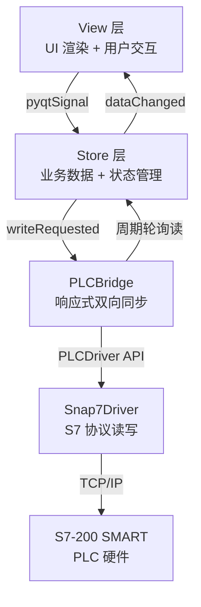

# PNServeXinjie 项目架构开发规范

## 1. 项目概述

| 项目 | 说明 |
|---|---|
| 项目名称 | PNServeXinjie |
| 技术栈 | Python 3 + PyQt6 |
| PLC 设备 | 西门子 S7-200 SMART ST20 |
| 通信协议 | S7 协议 (python-snap7) |
| 运行环境 | Windows |
| 虚拟环境 | `.venv\Scripts\python.exe` |

---

## 2. 目录结构

```
PNServeXinjie/
├── main.py                           # 应用入口
├── src/
│   ├── plc/                          # PLC 通信层
│   │   ├── __init__.py
│   │   ├── driver.py                 # PLCDriver 抽象基类
│   │   ├── snap7_driver.py           # Snap7 驱动实现
│   │   ├── binding.py                # PLCBinding 数据类
│   │   ├── binding_config.py         # ★ PLC 地址绑定映射表
│   │   └── bridge.py                 # PLCBridge 响应式桥接核心
│   ├── store/                        # 数据层 (Store)
│   │   ├── __init__.py
│   │   ├── manual_store.py           # 手动页面数据
│   │   ├── gas_store.py              # 气检页面数据
│   │   ├── auth_store.py             # 认证/权限
│   │   └── settings_store.py         # 全局配置
│   ├── view/                         # 视图层 (View)
│   │   ├── components.py             # 通用组件
│   │   ├── dashboard.py              # 主框架
│   │   ├── manual_page.py            # 手动页面
│   │   ├── gas_page.py               # 气检页面
│   │   └── settings_page.py          # 设置页面
│   └── common/                       # 公共工具
└── .venv/                            # Python 虚拟环境
```

---

## 3. 分层架构与职责



### 各层职责

| 层 | 职责 | 禁止 |
|---|---|---|
| **View** | 渲染 UI、响应用户操作、调用 Store 方法 | ❌ 直接操作 PLC |
| **Store** | 存储业务数据、emit 信号通知变更 | ❌ 直接操作 PLC、❌ 操作 UI 控件 |
| **PLCBridge** | 双向同步 Store ↔ PLC、脏检查、自动重连 | ❌ 操作 UI 控件、❌ 包含业务逻辑 |
| **PLCDriver** | 封装底层协议读写、字节序处理 | ❌ 知道 Store 存在 |

---

## 4. 命名规范

### 4.1 文件命名

- Python 模块: `snake_case.py`（如 `manual_store.py`, `snap7_driver.py`）
- 类名: `PascalCase`（如 `ManualStore`, `PLCBridge`）
- 常量: `UPPER_SNAKE_CASE`（如 `MANUAL_BINDINGS`）

### 4.2 Store 字段路径命名

Store 中与 PLC 绑定的字段使用 **点分路径** 命名：

```
{分类}.{名称}
{分类}.{设备号}.{属性}
```

| 前缀 | 含义 | 示例 |
|---|---|---|
| `signals.*` | 传感器/信号灯状态 (只读) | `signals.顶缸上限` |
| `q_status.*` | PLC Q 输出状态 (只读) | `q_status.OK` |
| `btn.*` | 按钮操作 (瞬时脉冲写) | `btn.顶缸伸出` |
| `enable.*` | 开关/使能 (电平保持写) | `enable.侧油` |
| `servo.{n}.*` | 伺服参数 | `servo.1.target_pos` |
| `mode.*` | 系统模式状态 (只读) | `mode.手动模式` |

### 4.3 pyqtSignal 命名

| 信号 | 用途 |
|---|---|
| `dataChanged` | Store 中任意数据变更 |
| `actionExecuted(str)` | 按钮动作被执行 |
| `writeRequested(str, object)` | 请求写入 PLC (路径, 值) |
| `connectionChanged(bool)` | PLC 连接状态变更 |
| `errorOccurred(str)` | PLC 通信异常 |

---

## 5. Store 开发规范

### 5.1 基本结构

每个 Store 必须继承 `QObject`，包含 `dataChanged` 信号：

```python
class XxxStore(QObject):
    dataChanged = pyqtSignal()
    writeRequested = pyqtSignal(str, object)  # 需写入 PLC 时添加

    def __init__(self, parent=None):
        super().__init__(parent)
        # 声明所有数据字段，使用 dict 组织
        self.field_name = { ... }

    def update_field(self, **kwargs):
        """更新字段后必须 emit dataChanged"""
        ...
        self.dataChanged.emit()
```

### 5.2 规则

1. **所有数据修改必须通过方法**，禁止外部直接赋值 `store.xxx = yyy`
2. **修改后必须 emit `dataChanged`**，确保 UI 能收到通知
3. **需要写 PLC 的操作额外 emit `writeRequested`**
4. **Store 不感知 View 和 PLC**，只负责数据存储和信号发射

---

## 6. PLC 绑定规范

### 6.1 PLCBinding 字段说明

```python
@dataclass
class PLCBinding:
    store_path: str     # Store 字段路径
    plc_area: str       # "M" 或 "V"
    byte_offset: int    # 字节偏移
    bit_offset: int     # 位偏移 (非 bool 类型为 -1)
    data_type: str      # "bool" | "byte" | "int16" | "int32" | "real"
    direction: str      # "read" | "write"
    write_mode: str     # "pulse" | "level" | "none"
```

### 6.2 新增 PLC 点位步骤

当 PLC 程序新增变量，需要同步到 UI 时：

1. 在 `binding_config.py` 添加一行 `PLCBinding(...)`
2. 在对应 Store 中添加数据字段
3. 在对应 View 中添加 UI 控件和信号绑定
4. **无需修改 PLCBridge 或 PLCDriver**

### 6.3 write_mode 规则

| 模式 | 适用场景 | 行为 |
|---|---|---|
| `pulse` | 按钮类操作 | UI `mousePress` → True, `mouseRelease` → False |
| `level` | 开关/使能类 | UI 切换后保持，直到再次切换 |
| `none` | 只读绑定 | 不写入 PLC |

---

## 7. View 开发规范

### 7.1 基本结构

```python
class XxxPage(QFrame):
    def __init__(self, store=None, parent=None):
        super().__init__(parent)
        self.store = store
        self._build_ui()
        self._connect_signals()

    def _build_ui(self):
        """构建 UI 布局和控件"""
        ...

    def _connect_signals(self):
        """绑定 Store 信号 → UI 刷新"""
        if self.store:
            self.store.dataChanged.connect(self._update_ui)

    def _update_ui(self):
        """从 Store 读取数据更新所有控件"""
        ...
```

### 7.2 按钮绑定规则

| 按钮类型 | 信号 | 示例 |
|---|---|---|
| 瞬时脉冲按钮 | `pressed` + `released` | 顶缸伸出/缩回 |
| 电平保持开关 | `toggled` (QCheckBox) | 使能侧油 |
| 伺服启动按钮 | `pressed` + `released` | UIBtnExecute |

```python
# ✅ 正确: 瞬时脉冲按钮
btn.pressed.connect(lambda: store.write_plc("btn.顶缸伸出", True))
btn.released.connect(lambda: store.write_plc("btn.顶缸伸出", False))

# ❌ 错误: 不要用 clicked 信号发送瞬时脉冲
btn.clicked.connect(lambda: store.write_plc("btn.顶缸伸出", True))
```

### 7.3 View 规则

1. **View 只通过 Store 获取数据**，禁止直接访问 PLC
2. **View 只在 `_update_ui()` 中更新控件**，保持单一刷新入口
3. **避免循环触发**: `_update_ui()` 更新输入控件时需阻塞信号

---

## 8. 信号流约定

### 只读数据流 (PLC → UI)

```
PLC 硬件 → Snap7Driver.read_xxx()
  → PLCBridge 脏检查 → Store.update_xxx()
  → emit dataChanged → View._update_ui()
```

### 瞬时脉冲写 (按钮 → PLC)

```
View: btn.pressed → Store.write_plc(path, True)
  → emit writeRequested(path, True)
  → PLCBridge → Snap7Driver.write_bool(True)

View: btn.released → Store.write_plc(path, False)
  → emit writeRequested(path, False)
  → PLCBridge → Snap7Driver.write_bool(False)
```

### 电平保持写 (开关 → PLC)

```
View: checkbox.toggled(True) → Store.write_plc(path, True)
  → emit writeRequested(path, True)
  → PLCBridge → Snap7Driver.write_bool(True)
```

---

## 9. 常见注意事项

> [!CAUTION]
> **S7-200 SMART 的 V 区通过 snap7 的 DB1 访问**。V 区地址 `VW500` 对应 `DB1.DBW500`，`VD612` 对应 `DB1.DBD612`。在 Snap7Driver 中 V 区统一映射为 `db_number=1`。

> [!WARNING]
> **字节序**: S7-200 SMART 使用 Big Endian，Python 默认 Little Endian。`Snap7Driver` 必须在读写 int16/int32/real 时做字节序转换。

> [!IMPORTANT]
> **线程安全**: PLCBridge 运行在独立 QThread 中，更新 Store 时使用 `QMetaObject.invokeMethod()` 或信号槽机制，确保 Store 方法在主线程执行。

> [!TIP]
> **所有 pip 安装和脚本运行必须使用 `.venv`**：
> ```powershell
> .venv\Scripts\pip.exe install python-snap7
> .venv\Scripts\python.exe main.py
> ```
